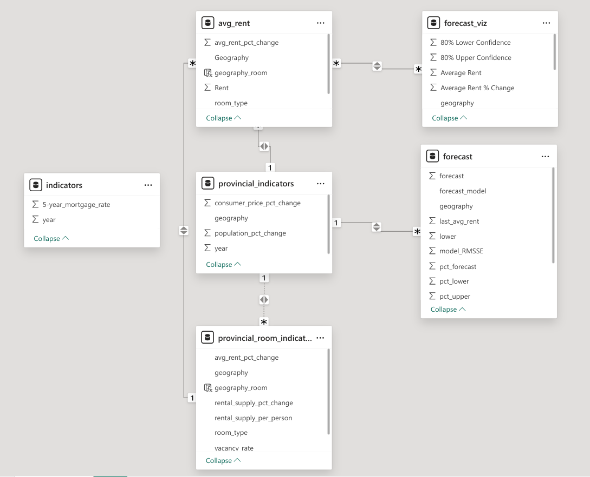

## Introduction

Rentals play an important role in providing housing for residents of Canada. Recent economic stresses have created volatility in the rental market highlighting the need for both renters and landlords to stay up to date on current factors driving rent prices. To address the need for information, I created a rental market dashboard with data from Statistics Canada and CMHC and forecasted rent prices in Power BI.

## Methodology

Data was taken from APIs from Statistics Canada and CMHC portals. Data was transformed and rent was modeled. Best performing model was selected and used to forecast the next year. Data is then visualized in Power BI.

### Obtaining data from Statistics Canada and CMHC

Statistics Canada releases economic data and indicators for Canada. They make their data available through an API. cansim is an R wrapper around their API that makes it easier to retrieve standardized data in R. The Canadian Mortgage and Housing Corporation (CMHC) releases housing and rental data for Canada. This information is made available through their data portal. cmhc is an R package written to obtain data from that portal. A list of sgc codes is required for cmhc. A list of provinces (excluding territories) was provided.

Time series of several economic indicators were taken from Statistics Canada in order to provide exogenous regressors for modeling. Data from CMHC, including rent prices, was taken and combined with data from CMHC on date, geography and rental room type.

### Modeling Rent Prices

Rent price per year was adjusted by consumer price index to account for inflation. They were also transformed to percent rent price change per year to create a more stationary response variable for models that perform better on stationary data.

Rent price was modeled by ARIMA, ETS, linear regression, drift, mean and naive. Mean, naive and drift models were used as a baseline. Model performance was assessed by time series cross validation with a forecast of one year. Models were compared with RMSSE to account for scale differences between models trained on rent price vs those trained on percentage rent price per year (depending on model requirements).

```{r eval=FALSE, include=TRUE}
base_models <- tscv_model_data |>
  model(
    mean = MEAN(avg_rent_cpi_adj_pct_change),
    naive = NAIVE(avg_rent_cpi_adj_pct_change)
  )
rw_models <- tscv_model_data |>
  model(
    drift = RW(avg_rent_cpi_adj ~ drift())
  )
arima_models <- tscv_model_data |>
  model(
    arima = ARIMA(avg_rent_cpi_adj_pct_change)
  )  
ets_models <- tscv_model_data |>
  model(
    ets = ETS(avg_rent_cpi_adj)
  )
linear_models <- lagged_tscv_model_data |>
  model(
    base_linear = TSLM(avg_rent_cpi_adj_pct_change ~ lagged_rental_supply_per_person_pct_change + lagged_five_year_mortgage_change),
    trended_linear = TSLM(avg_rent_cpi_adj_pct_change ~ trend() + lagged_rental_supply_per_person_pct_change + lagged_five_year_mortgage_change)
  )
```

Ljung box test was used to check residuals on the longest cross validation set. Models failing test were removed prior to model selection.

```{r eval=FALSE, include=TRUE}
get_ljung_box <- function(model, lag) {
  ljung_box_stats <- model |>
    augment() |>
    features(.innov, ljung_box, lag = lag) |>
    filter(`.id` == max(`.id`, na.rm = TRUE)) |> 
    select(-`.id`)
  
  return(ljung_box_stats)
}

base_residuals <- base_models |>
  get_ljung_box(lag = 4)
rw_residuals <- rw_models |>
  get_ljung_box(lag = 4)
arima_residuals <- arima_models |>
  get_ljung_box(lag = 4)
ets_residuals <- ets_models |>
  get_ljung_box(lag = 4)
linear_residuals <- linear_models |>
  get_ljung_box(lag = 4)
```

### Visualizing Data in Power BI

To visualize rent data in Power BI, relevant tables were converted to excel format prior to ingestion.

```{r eval=FALSE, include=TRUE}
named_excel_table_list <- list(
  avg_rent = avg_rent_data,
  provincial_room_indicators = yearly_provincial_room_indicators_data,
  provincial_indicators = yearly_provincial_indicators_data,
  indicators = yearly_indicators_data,
  forecast = yearly_forecast_table
)

create_canadian_rent_excel_tables <- function(named_excel_table_list) {
  workbook <- createWorkbook()
  
  table_names <- names(named_excel_table_list)
  
  create_excel_pages_and_tables <- function(table_name, table) {
    addWorksheet(workbook, table_name)
    writeDataTable(workbook, sheet = table_name, x = table, tableName = table_name)
  }
  
  mapply(
    create_excel_pages_and_tables,
    table_name = table_names,
    table = named_excel_table_list
  )
  
  return(workbook)
}

excel_workbook <- named_excel_table_list |>
  create_canadian_rent_excel_tables()
```

In Power BI a new table was created to visualize forecasting data using DAX.

```{DAX eval = FALSE, include = TRUE}
forecast_viz = ADDCOLUMNS(
  DISTINCT(
    UNION(
      SELECTCOLUMNS(
        avg_rent, "year", avg_rent[year], "geography", avg_rent[Geography], 
        "room_type", avg_rent[room_type], "Average Rent", avg_rent[Rent], 
        "Average Rent % Change", [avg_rent_pct_change], "80% Upper Confidence",
        avg_rent[Rent], "Percent 80% Upper Confidence", 
        avg_rent[avg_rent_pct_change], "80% Lower Confidence", avg_rent[Rent], 
        "Percent 80% Lower Confidence", avg_rent[avg_rent_pct_change]
      ), 
      SELECTCOLUMNS(
        forecast, "year", forecast[year], "geography", forecast[geography], 
        "room_type", forecast[room_type], "Average Rent", forecast[forecast], 
        "Average Rent % Change", forecast[pct_forecast], "80% Upper Confidence", 
        forecast[upper], "Percent 80% Upper Confidence", forecast[pct_upper], 
        "80% Lower Confidence", forecast[lower], "Percent 80% Lower Confidence", 
        forecast[pct_lower]
      )
    )
  ), 
  "geography_room", CONCATENATE([geography], [room_type])
)
```

Data model was organized as shown below:

```{r eval = TRUE, echo = FALSE, fig.align = "center"}

```

Importantly, several indicators were connected through a concatenation of geography and room type to ensure cross filtering would work across both variables.

## References

O'Hara-Wild M, Hyndman R, Wang E (2024). *fable: Forecasting Models for Tidy Time Series*. R package version 0.3.4, <https://CRAN.R-project.org/package=fable>

O'Hara-Wild M, Hyndman R, Wang E (2024). *feasts: Feature Extraction and Statistics for Time Series*. R package version 0.3.2, <https://CRAN.R-project.org/package=feasts>.

von Bergmann and Shkolnik (2021). *cansim: Accessing Statistics Canada Data Table and Vectors*. <https://CRAN.R-project.org/package=cansim>.

von Bergmann J (2023). *cmhc: Access, Retrieve, and Work with CMHC Data*. R package version 0.2.7, <https://CRAN.R-project.org/package=cmhc>.

Wickham H, Averick M, Bryan J, Chang W, McGowan LD, François R, Grolemund G, Hayes A, Henry L, Hester J, Kuhn M, Pedersen TL, Miller E, Bache SM, Müller K, Ooms J, Robinson D, Seidel DP, Spinu V, Takahashi K, Vaughan D, Wilke C, Woo K, Yutani H (2019). "Welcome to the *tidyverse.*" Journal of Open Source Software, 4(43), 1686. <doi:10.21105/joss.01686>.
